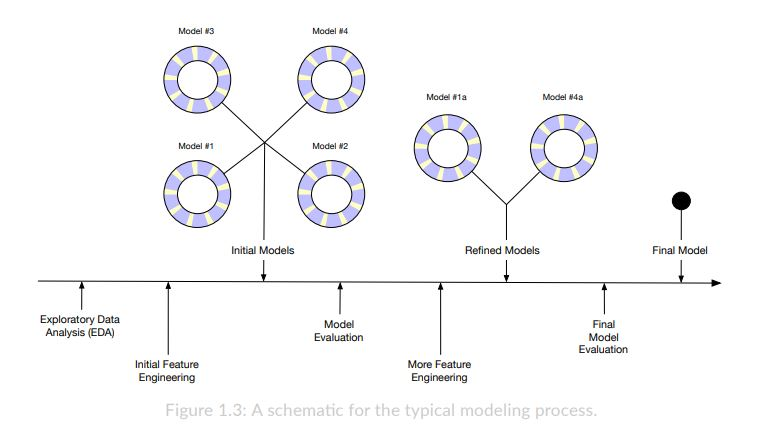

```{r setup, include=FALSE}
knitr::opts_chunk$set(echo = TRUE)
```

## Glosario de términos (NBA.com/stats & HTML de clase)

-   Player: nombre y apellidos del jugador.
-   Salary: salario, la variable dependiente y la que queremos predecir
-   NBA_Country: nacionalidad del jugador
-   NBA_DraftNumber: el númro de draft del jugador
-   Age: edad.
-   Tm: nombre de su equipo.
-   G: partidos que ha jugado.
-   MP: minutos jugados
-   PER: medida de eficiencia del jugador estandarizada sobre la media
    de la liga (15).
-   TS%: porcentaje de aciertos de cualquier tipo de tiro.
-   3PAr: porcentaje de triples que el jugador tira respecto a sus tiros
    de campo totales.
-   FTr: porcentaje de tiros libres respecto a sus tiros de campo
    totales.
-   ORB%: porcentaje de rebotes ofensivos que el jugador consigue.
-   DRB%: porcentaje de rebotes defensivos que el jugador consigue.
-   TRB%: porcentaje de rebotes que el jugador agarra, en general.
-   AST%: porcentaje de tiros de compañeros que el jugador ha asistido.
-   STL%: porcentaje de robos de un jugador respecto a los robos totales
    de su equipo.
-   BLK%: porcentaje de tapones del jugador respecto a los de su equipo.
-   TOV%: porcentaje de jugadas que acaban en turnover (recuperación).
-   USG%: porcentaje de uso, las jugadas en las que el jugador
    interviene respecto al total de jugadas de su equipo.
-   OWS: estimacion de las victorias que se deben a la habilidad
    ofensiva del jugador.
-   DWS: estimacion de las victorias que se deben a la habilidad
    defensiva del jugador.
-   WS: estimación de las victorias que se deben a la habilidad general
    del jugador.
-   WS/48: normalicacion de WS por cada 48 minutos. Por cada 48 minutos
    de juego del jugador, cuantas victorias genera.
-   OBPM: estimación de los puntos ofensivos de cada 100 posesiones en
    los cuales el jugador ha contribuido más que la media de la liga,
    traducido a la media del equipo.
-   DBPM: estimación de los puntos defensivos de cada 100 posesiones en
    los cuales el jugador ha contribuido más que la media de la liga,
    traducido a la media del equipo.
-   BPM: estimación de los puntos generales de cada 100 posesiones en
    los cuales el jugador ha contribuido más que la media de la liga,
    traducido a la media del equipo.
-   VORP: mide el rendimiento de un jugador contra el que daria un
    "jugador medio"

## Primeras ideas sobre las variables:

Hay varias variables que no sirven de nada, como el nombre, la
nacionalidad etc. Otras se dividen entre ofensivas, defensivas, y luego
se agrupan en totales. Conviene estudiar el comportamiento de esas
variables, ver si con las totales es posible prescindir de las otras,
quizá sean muy específicas.

## Proceso a seguir



## EDA

```{r paquetes, warning= FALSE, message= FALSE, include= FALSE}
library(dplyr)
library(broom)
library(ggcorrplot)
library(Hmisc)
library(car)
```

```{r codigo para poder probar lo demas }
nba <- read.csv("./data/nba.csv")
dim(nba) # 458 observaciones, 28 variables 
sample_size <- floor(0.75 * nrow(nba)) # tamaño de la particion (floor aproxima)

set.seed(1234)
train_id <- sample(nrow(nba), size = sample_size)
train <- nba[train_id, ]
test <- nba[-train_id, ]

glimpse(nba) # vistazo rapido a las variables

# Comrpobacion de ausencia de valores duplicdos
sum(duplicated(nba))
#(HACER DICCIONARIO DE DATOS)

# Comprobacion de NA's
sum(is.na(nba)) # 8 na en todo el dataset.

nba[rowSums(is.na(nba)) > 0, ] 
# aplicando la fila de sumas al resultado de is.na(nba) y filtrando por mayor 
# a 0, se obtienen las filas que tienen NA. Son la 30 y la 38. 
# Tyler Lydon y Trey McKinney-Jones. Los elimino. 

nba <- nba[-c(30, 38),]

# Salarios mas alto 

nba[which.max(nba$Salary),] # Stephen Curry, salario mas alto 

```

### Correlaciones

```{r todas las correlaciones}
rh <- rcorr(as.matrix(nba[, -c(1, 3, 6)]), type = "pearson")
ggcorrplot(rh$r, method = 'square', type = 'lower') +
  ggtitle("Todas las variables") +
  theme_bw() +
  theme_minimal() +
  xlab(NULL) + ylab(NULL) +
  theme(axis.text.x = element_text(angle =  90))
```

```{r correlaciones mas fuertes}
correlaciones_fuertes <- nba %>% 
  select(ORB., DRB., TRB., DWS, OWS, WS, 
         PER, WS.48, OBPM, BPM, VORP)
rh_fuertes <- rcorr(as.matrix(correlaciones_fuertes, type = "pearson"))
    
# Grafico de las fuertes 
ggcorrplot(rh_fuertes$r, method = 'square', type = 'lower', lab = TRUE) +
  ggtitle("Variables fuertes") +
  theme_bw() +
  theme_minimal() +
  xlab(NULL) + ylab(NULL) +
  theme(axis.text.x = element_text(angle =  90)) 

```

### Graficos de dispersion

Todos los gráficos de dispersión contra salario mediante un loop

```{r loop scatter}
# Grafico de todas las correlaciones, una a una con el salario 
nba_numericas <- nba %>% 
  select(-c(1, 3, 6))  # aqui estoy quitando algunas categoricas

for (var in names(nba_numericas)) {
  plot <- ggplot(nba_numericas, aes(x = nba[, var], 
                                    y = Salary)) +
    geom_point(color = "aquamarine3") +
    labs(x = var) +
    theme_minimal() 
    
  print(plot)
}

```

### Historgramas

```{r histogramas}

for (var in names(nba_numericas)) {
  plot <- ggplot(nba_numericas, aes(x = nba[, var])) +
    geom_density(fill = "aquamarine", alpha = 0.5 ) +
    labs(x = var, title = var) +
    theme_minimal()
  print(plot)
}


# Muchas de ellas estan concetnradas en torno a una media, no hay 
# mucha dispersion.

```

## Initial Feature Engineering

## Initial Models

### Model evaluation

## More Feature Engineering

## Refined models

## Final model evaluation

## Final model
