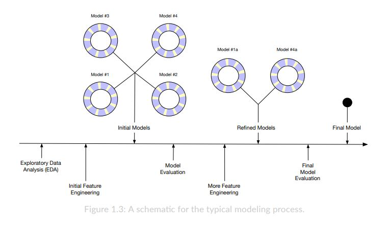

```{r setup, include=FALSE}
knitr::opts_chunk$set(echo = TRUE, warning = FALSE, message = FALSE)
```

# Motivación del trabajo

La motivación de este trabajo es la elaboración de un modelo predictivo
que permita estimar, con la mayor precisión posible, los salarios
anuales de jugadores de la NBA. Para ello, se utiliza un dataset con
distitnas variables relativas a una serie de jugadores de la NBA, y
siguiendo las etapas típicas de un proyecto de predicción, se intenta
implementar el mejor modelo predictivo.

# Etapas del proceso

Las fases de la investigación son las estudiadas en clase y se asemejan
al siguiente diagrama:\


En primer lugar, se realiza un análisis exploratorio de los datos, en
este caso poniendo primro el foco en las variables cuantitativas, y más
tarde en las categóricas.

Después, en la fase de ingeniería de variables, se modifican algunas de
las variables existentes con el fin de transformar los datos disponibles
y hacer que encajen mejor en los modelos.

Posteriormente, se plantean una serie de modelos, basados en parte en el
análisis exploratorio así como en algoritmos de selección de variables.

Tras el planteamiento de los primeros modelos, se pasa a evaluar la
precision de éstos, y se elige aquel que tenga mejor capacidad
predictiva. Ese mismo modelo se evalúa de nuevo, y se plantea nuevamente
ingeniería de variables con el objetivo de tratar de refinar el modelo,
y mejorar la predicción.

Finalmente, se evalua el modelo final sobre una muestra de los datos y
se valoran sus métricas.

## Contrastes de hipótesis.

Es importante recordar que para que los modelos funcionen correctamente,
es necesario verificar que se cumplen una serie de supuestos, tales
como:

-   Normalidad

-   Homocedasticidad

-   Ausencia de multicolinealidad

-   Linealidad

No obstante, estas comprobaciones son propias de modelos descriptivos, y
el caso que ocupa a este trabajo es el desarrollo de un modelo
predictivo. Por esta razón, no se llevan a cabo este tipo de contrastes,
ni se pone el foco en la capacidad explicativa del modelo, sino que se
valoran sus capacidades predictivas.

### Glosario de términos.

A continuación se incluye la descripción de cada una de las variables
del dataset, utilizando la materia de clase y el apartado de
estadísticas de la página web de la NBA.

-   Player: nombre y apellidos del jugador.
-   Salary: salario anual, la variable dependiente y la que se busca
    predecir, medido en dólares.
-   NBA_Country: nacionalidad del jugador.
-   NBA_DraftNumber: el número de draft del jugador, es decir, en qué
    puesto entró en la NBA.
-   Age: edad del jugador.
-   Tm: nombre de su equipo.
-   G: partidos que ha jugado en la temporada regular de 82 partidos.
-   MP: minutos jugados en toda la temporada.
-   PER: medida de eficiencia del jugador estandarizada sobre la media
    de la liga (15).
-   TS%: porcentaje de aciertos de cualquier tipo de tiro.
-   3PAr: porcentaje de triples que el jugador tira respecto a sus tiros
    de campo totales.
-   FTr: porcentaje de tiros libres tirados respecto a sus tiros de
    campo totales.
-   ORB%: porcentaje de rebotes ofensivos que el jugador consigue.
-   DRB%: porcentaje de rebotes defensivos que el jugador consigue.
-   TRB%: porcentaje de rebotes que el jugador consigue, en general.
-   AST%: porcentaje de tiros de compañeros que el jugador ha asistido.
-   STL%: porcentaje de robos de un jugador respecto a los robos totales
    de su equipo.
-   BLK%: porcentaje de tapones del jugador respecto a los de su equipo.
-   TOV%: porcentaje de jugadas que acaban en turnover (recuperación).
-   USG%: porcentaje de uso, las jugadas en las que el jugador
    interviene respecto al total de jugadas de su equipo.
-   OWS: estimacion de las victorias que se deben a la habilidad
    ofensiva del jugador.
-   DWS: estimacion de las victorias que se deben a la habilidad
    defensiva del jugador.
-   WS: estimación de las victorias que se deben a la habilidad general
    del jugador.
-   WS/48: normalicacion de WS por cada 48 minutos. Por cada 48 minutos
    de juego del jugador, cuantas victorias genera.
-   OBPM: estimación de los puntos ofensivos de cada 100 posesiones en
    los cuales el jugador ha contribuido más que la media de la liga,
    traducido a la media del equipo.
-   DBPM: estimación de los puntos defensivos de cada 100 posesiones en
    los cuales el jugador ha contribuido más que la media de la liga,
    traducido a la media del equipo.
-   BPM: estimación de los puntos generales de cada 100 posesiones en
    los cuales el jugador ha contribuido más que la media de la liga,
    traducido a la media del equipo.
-   VORP: mide el rendimiento de un jugador contra el que daria un
    "jugador medio".

# Análisis exploratorio

```{r paquetes}
library(dplyr)
library(broom)
library(ggcorrplot)
library(Hmisc)
library(car)
library(plotly)
```

Como ya se ha comentado, la primera parte consiste en un análisis
exploratorio de los datos.

```{r carga de los datos}

# Importacion de los datos
nba <- read.csv("./data/nba.csv")

# Dimensiones del dataframe
dim(nba) # 458 observaciones, 28 variables 

glimpse(nba) # vistazo rapido a las variables
```

El dataset consta de 458 observaciones, con 28 variables de distinto
formato. Tres de las variables son categóricas, algo a tener en cuenta
si se quieren utilizar para las predicciones, y el resto de variables
son numéricas. Antes de continuar, se evalúa la presencia de valores no
disponibles, algo que puede entorpecer el resto de procesos. También se
comprueba la ausencia de valores duplicados, pese a que el enunciado
indica que ya se han elimiando, solo para comrpobar que no ha habido
problemas en la carga de los datos.

```{r NAs y duplicados}

sum(duplicated(nba)) # no hay valores duplicados 

# Comprobacion de NA's
sum(is.na(nba)) # 8 na en todo el dataset.

nba[rowSums(is.na(nba)) > 0, ] 
# aplicando la fila de sumas al resultado de is.na(nba) y filtrando por mayor a 0, se obtienen las filas que tienen NA. 
# Son la 30 y la 38, Tyler Lydon y Trey McKinney-Jones, los elimino
nba <- nba[-c(30, 38),]
```

Se encuentran un total de 8 valores no disponibles, correspondientes a
las observaciones de Tyler Lydon y Trey McKinney-Jones. Dada la cantidad
de datos disponibles, se opta por la eliminación de estas dos
observaciones, puesto que el efecto de su ausencia no tiene repercusión
notable.

## Correlaciones

Se examinan las correlaciones de las variables cuantitativas, con el fin
de tener una primera idea de qué puede influir en el salario de los
jugadores. No obstante, es necesario recordar que correlación no implica
causalidad.

```{r todas las correlaciones}
nbaNumericas <- nba %>% 
  select(-c(1, 3, 6))  # creo un nuevo dataframe que cotniene solo
# las variables numéricas

rh <- rcorr(as.matrix(nbaNumericas), # solo las cuantitativas
            type = "pearson")


# Correlograma 
ggcorrplot(rh$r, method = 'square', type = 'lower') +
  # Títulos y aspectos visuales
  ggtitle("Correlograma") +
  theme_bw() +
  theme_minimal() +
  xlab(NULL) + ylab(NULL) +
  theme(axis.text.x = element_text(angle =  90)) # rotacion del  
  # texto del eje x para facilitar su lectura
```

No hay variables que estén fuertemente correlacionadas con el salario.
No obstante, para el primer modelo se incluirán aquellas que tienen más
de un 0.25 de correlación, positiva o negativa. Estas variables son el
número del draft, Win Share (WS), el valor de reemplazo (VORP), los
minutos jugados (MP) y la edad del jugador (Age). Se excluye la salida
de la matriz, porque es una matriz de dimensiones 25 x 25. No obstante,
se puede acceder a los datos con `rh$r`.

Se puede apreciar que existen distintas variables que presentan alta
correlacion entre ellas. Este fenómeno se da en aquellas que están
relacionadas, como por ejemplo el porcentaje de rebotes ofensivos,
defensivos y totales. A continuación se muestra un correlograma que
incluye exclusivamente estas variables.

```{r correlaciones mas fuertes entre si}

correlacionesFuertes <- nbaNumericas %>% 
  select(ORB., DRB., TRB., DWS, OWS, WS, 
         PER, WS.48, OBPM, BPM, VORP) # selecciono las variables del 
# dataset

# Calculo las correlaciones
rhFuertes <- rcorr(as.matrix(correlacionesFuertes, 
                             type = "pearson"))
    
# Correlograma
ggcorrplot(rhFuertes$r, 
           method = 'square', 
           type = 'lower', 
           lab = TRUE) + # añade los valores numéricos
  # Titulos y aspectos visuales 
  ggtitle("Correlaciones fuertes") +
  theme_bw() +
  theme_minimal() +
  xlab(NULL) + ylab(NULL) +
  theme(axis.text.x = element_text(angle =  90)) # rotación del  
  # texto del eje x para facilitar su lectura

```

## Gráficos de dispersión

A continuación se representan gráficamente todas las variables numéricas
en forma de gráfico de dispersión, manteniendo el salario siempre en el
eje Y. La ejecución se lleva a cabo con un bucle, para acortar el código

```{r loop scatter}
# Grafico de todas las correlaciones, una a una con el salario 
for (var in names(nbaNumericas)) {
  # para cada variable del dataset...
  
  # se crea el objeto "plot" con el gráfico de dispersión 
  # correspondiente
  plot <- ggplot(nbaNumericas, 
                 aes(x = nbaNumericas[, var], # el eje varía
                     y = Salary)) + # el eje y es fijo
    geom_point(color = "aquamarine3") +
    
    # Tema y etiquetas
    labs(x = var,
         y = "Salario anual") +
    theme_minimal() 
    
  print(plot) # importante, sin el el loop no genera output. 
}

```

De todas las visualizaciones anteriores, se puede concluir que en todos
los casos existe una gran dispersión. En principio, no parece haber
grupos diferenciados en cada variable, y para mismos niveles de cada
variable, el salario varía mucho. No obstante, la variable que mayor
relación parece presentar con el salario es el número del draft. Se
aprecia una tendencia negativa, a medida que el número del draft
aumenta, el salario anual se reduce. No obstante, para esta variable
también existe mucha dispersión en términos de salario para cada
variable.

## Funciones de densidad

De manera similar a las visualizaciones de los gráficos de dispersión,
se trabaja con un bucle y se representan las funciones de densidad de
todas las variables.

```{r funciones de densidad}

for (var in names(nbaNumericas)) {
  plot <- ggplot(nbaNumericas, aes(x = nbaNumericas[, var])) +
    # Gráfico de densidad
    geom_density(fill = "aquamarine3", alpha = 0.5 ) +
    
    # Tema, título y etiquetas
    labs(title = var,
         x = var) +
    theme_minimal()
  
  print(plot)
}


# Muchas de ellas estan concetnradas en torno a una media, no hay 
# mucha dispersion.

```

La mayoría de variables presenta una distribución estrecha, con poca
varianza. Sin embargo, variables como el número del draft o los minutos
jugados parecen agruparse en torno a dos puntos diferenciados. Puede ser
interesante estudiar estas características y decidir si es conveniente
hacer agrupaciones para variables, especialmente para el grupo de draft.

## Variables cuantitativas

Se excluye del análisis a la variable de nombre del jugador, porque es
coherente pensar que no es útil a la hora de determinar el salario.

### Equipo 

El siguiente gráfico muestra el salario medio por equipos

```{r equipos salario medio y mediano}
ggplot(nba, 
       aes(x = Tm, y = mean(Salary)), 
       ) +
  geom_col(fill = "aquamarine3") + # media en verde
  geom_col(aes(y = median(Salary)), # mediana en azul
           fill = "lightblue") +
  coord_flip() +
  theme_minimal() + 
  labs(title = "Salario medio y mediano por equipos",
       x = "Equipo",
       y = "Salario medio y mediano")
```

Tal como se puede observar, el salario medio por equipos es bastante
similar. El único valor que destaca claramente es el de "TOT", que hace
referencia a jugadores que en la misma temporada han cambiado de equipo.
En color azul se representa la mediana, puesto que es robusta a valores
extremos. El valor es igualmente similar por equipos.

```{r jugadores con varios equipos}
nba %>% filter(Tm == "TOT") %>% arrange(desc(Salary))

```

Seria interesante construir una nueva variable, que contraste si el
jugador ha jugado en varios equipos o no.

### Nacionalidad

Visualizacion de los jugadores por su nacionalidad

```{r Nacionalidad }

ggplot(nba, 
       aes(x = NBA_Country), 
       ) +
  geom_bar(fill = "aquamarine3", 
       color = "black") +
  coord_flip() +
  theme_minimal() + 
  labs(title = "Nacionalidad de los jugadores",
       y = "Nº de jugadores",
       x = "Nacionalidad")

```

La inmnesa mayoria de los jugadores son de nacionalidad estadounidense.
A continuacion una visualicación que excluye a USA, para ver bien los
jugadores en el resto

```{r sin USA}
nba %>% 
  filter(NBA_Country != "USA") %>% # el filtro para paises                                               # distintos a usa
  ggplot(aes(x = NBA_Country)) +
  geom_bar(fill = "aquamarine3", color = "black") +
  coord_flip() +
  theme_minimal() + 
  labs(title = "Nacionalidad de los jugadores (excluida USA)",
       y = "Nº de jugadores",
       x = "Nacionalidad")
```

# Ingeniería de variables inicial

En base a las variables categóricas examinadas, en este apartado se
plantean una serie de transformaciones y creaciones de variables, para
extender el análisis de datos, y para incluirlas en el modelo si pudiese
resultar interesante.

### Equipo

El gráfico de salario medio y mediano para cada equipo revela que la
categoría "TOT", la cual recoge a los jugadores que han jugadoen varios
equipos en la misma temporada, tiene valores muy superiores al resto.
Puesto que quizá sea interesante introducir una variable que recoja esta
diferencia en el modelo, se procede a su creación, mediante "string
encoding"

```{r Feat Eng equipos}
nba <- nba %>% mutate(
  variosEquipos = case_when(Tm == "TOT" ~ "Varios equipos",
                            Tm != "TOT" ~ "Un solo equipo"
  )
)
# Se crea la variable "variosEquipos" que tomará el valor 
# "Varios equipos" si el jugador ha jugado en varios equipos, 
# y "Un solo equipo en caso contrario"


# Paso a factor
nba$variosEquipos <- as.factor(nba$variosEquipos)
```

Una vez creada la variable, se procede a examinar el comportamiento del
salario para cada grupo

```{r Feat Eng equipos grafico}

ggplotly( # ggplotly transforma el gráfico en interactivo
ggplot(nba, aes(x = variosEquipos, 
                y = Salary, 
                fill = variosEquipos))+
  geom_boxplot() +
  labs(title = "Un equipo vs. varios",
       x = NULL, 
       y = "Salario",
       fill = NULL) + # titulo de la leyenda
  theme_minimal() +
  theme(axis.text.x = element_blank()) # quita las x ticks
)
```

Pese a lo constatado al analizar la categoría de varios equipos contra
los equipos de manera individual, el grafico de caja y bigotes muestra
que, al comparar ambos grupos, no existen grandes diferencias. El
salario mediano es practicamente el mismo, aunque la distribucón es algo
más pequeña en el grupo de varios equipos. Hay que tener en cuenta que
este grupo tiene muchos menos individuos que el grupo de un solo equipo.

```{r test igualdad de medias}
t.test(nba$Salary ~ nba$variosEquipos)
```

El t-test, que establece como hipótesis nula la igualdad de media entre
grupos, devuelve un p.valor que no permite rechazar la igualdad, aunque
por poco. El salario medio de los dos grupos es estadísticamente igual.

No obstante, a continuación se crea una nueva variable "dummy"
utilizando la técnica de "one hot encoding" con el fin de poder incluir
esta variable en los modelos, para ver su efecto.

```{r Feat Eng equipos dummy}

nba <- nba %>% 
  mutate(variosEquiposDummy = ifelse(Tm == "TOT", 1, 0))
# Toma el valor 1 si el jugador ha judado en mas de un equipo
```

### Nacionalidad

Igual que para el caso del equipo, se crea una nueva variable que
codifique si el jugador es estadounidense o no. El procedimiento es el
mismo.

```{r Feat Eng nacionalidad}
# Creacion de la nueva columna
nba <- nba %>% mutate(nacionalidad = 
                    case_when(NBA_Country == "USA" ~ "USA",
                              NBA_Country != "USA"~ "NotUSA"))


# Conversión a factor
nba$nacionalidad <- as.factor(nba$nacionalidad)

 

ggplotly( # ggplotly transforma el gráfico en interactivo
ggplot(nba, aes(x = nacionalidad, 
                y = Salary, 
                fill = nacionalidad))+
  geom_boxplot() +
  labs(title = "Salarios de estadounidenses vs. no estadounidenses",
       x = NULL, 
       y = "Salario",
       fill = NULL) + # titulo de la leyenda
  theme_minimal() +
  theme(axis.text.x = element_blank()) # quita las x ticks
)
```

Igual que para el caso de los equipos, las distribuciones son casi
iguales

```{r contraste nacionalidad}
t.test(nba$Salary ~ nba$nacionalidad)
```

No se rechaza la igualdad de medias. Igualmente, se genera la variable
"dummy" de cara a incluirla en los modelos.

```{r Feat Eng usa Dummy}
nba <- nba %>% 
  mutate(nacionalidadDummy = ifelse(nacionalidad == "USA", 1, 0))
# Toma el valor 1 si el jugador es de USA
```

## Modelos iniciales

Inicialmente, se construyen los siguientes modelos:

Un modelo con las variables que resultaron más correlacionadas con el
salario

```{r modelo Mas Correlacionadas}
modeloMasCorrelacionadas <- lm(
  formula = Salary ~ NBA_DraftNumber + WS + VORP + MP + Age, 
              data = nba)
```

Un segundo modelo, que es el anterior pero con el numero del draft al
cuadrado

```{r modelo draft cuadrado}
modeloDraftCuadrado <- lm(
  formula = Salary ~ I(NBA_DraftNumber^2) + WS + VORP + MP + Age, 
              data = nba)

```

Un terce modelo, que incluye interacciones entre el draft y la edad

```{r modelo Draft Edad}
modeloDraftEdad <- lm(
  formula = Salary ~ NBA_DraftNumber:Age + WS + VORP + MP, 
              data = nba)
```

Finalmente, un cuarto modelo, que incluye las variables dummy creadas

```{r modeloDummy}
modeloDummy <- lm(
  formula = Salary ~ NBA_DraftNumber + Age + WS + VORP + MP +
    nacionalidadDummy + variosEquiposDummy, 
              data = nba)

```

Antes de pasar a la selección de variables con el método stepwise, se
comparan los modelos anteriores mediante el criterio de información de
Akaike.

```{r comparacion inicial}
AIC(modeloMasCorrelacionadas, 
    modeloDraftCuadrado, 
    modeloDraftEdad, 
    modeloDummy)
```

Utilizando el AIC, el mejor modelo es el primero. No obstante, antes de
evaluarlo, se utiliza el método stepwise para ver cuales son las
variables que minimizan el AIC del modelo

```{r stepAIC}
library(MASS) # no he cargado antes MASS porque la funcion 
# select interfiere con la de dplyr, y asi no tengo que  usar
# dplyr::select tantas veces 

# Utilizo backward porque en el script utilicé backward, forward y 
# mixto, y el de menor AIC fue el de backward.

nbaNumericas <- nba[, -c(1 , 3, 6, 29, 31)] 
# Primero actualizo el dataset
# de variables numericas, de manera que contenga las nuevas dummy.
# El 29 y el 31 hacen referencia a las nuevas variables creadas 
# con string encoding, tambien hay que excluirlas

modeloTotal <- lm(Salary ~., data = nbaNumericas) # defino un modelo  # con todo
stepAIC(modeloTotal, direction = "backward") # ejecuto el stepwise
```

Con un AIC de 1492, el modelo obtenido mediante stepwise backward es el
siguiente

```{r modeloStepwiseBack}
modeloStepBack <- lm(
  formula = Salary ~ NBA_DraftNumber + Age + G + MP + PER + 
    X3PAr + ORB. + TRB. + USG. + WS + OBPM, data = nbaNumericas)
```

# Evaluación del modelo

A continuación algunas medidas del modelo

```{r}
summary(modeloStepBack)
```

El modelo tiene un error estandar de la regresion bastane grande, y
aunque la media de los resiudos no es demasiado elevada, la distribución
de los mismos si lo es. Por ello, a continuación se realiza más
ingenieria de variables, con el fin de mejorar la estimación

## Ingeniería de variables II

### Draft por grupos

A continuación se secciona la variable draft en 6 grupos de unas 10
posiciones en cada grupo, con el objetivo de ver su influencia en el
salari, y como puede afectar al modelo introducir una variable que
contraste la pertenencia a cada grupo.

```{r grupos de draft}
# Primero string encoding
# Se crea una nueva variable para cada intervalo de 10 drafteados
nba <- nba %>% 
  mutate(draft_group = 
                 case_when(
                   NBA_DraftNumber >= 1 & 
                     NBA_DraftNumber <= 10 ~ "[1-10]",
                   
                   NBA_DraftNumber >= 11 & 
                     NBA_DraftNumber <= 20 ~ "[11-20]",
                   
                   NBA_DraftNumber >= 21 & 
                     NBA_DraftNumber <= 30 ~ "[21-30]",
                   
                   NBA_DraftNumber >= 31 & 
                     NBA_DraftNumber <= 40 ~ "[31-40]",
                   
                   NBA_DraftNumber >= 41 & 
                     NBA_DraftNumber <= 50 ~ "[41-50]",
                   
                   NBA_DraftNumber >= 51 ~ "[51-70]"))

# paso a factor
nba$draft_group <- as.factor(nba$draft_group)

# Grafico respecto a grupos
ggplotly(
  ggplot(nba, aes(x = draft_group, y = Salary, fill = draft_group)) +
    geom_boxplot() +
    scale_y_log10() +
    labs(title = "Salario vs. draft",
         y = "Salario", 
         x = "Grupo de draft",
         fill = NULL) +
    theme_minimal() 
) 

# Diagramas de violin 
ggplotly(
  ggplot(nba, aes(x = draft_group, y = Salary, fill = draft_group)) +
    geom_violin() +
    scale_y_log10() +
    labs(title = "Salario vs. draft",
         y = "Salario", 
         x = "Grupo de draft",
         fill = NULL) +
    theme_minimal() 
) 
```

Se representan los salarios en escala logarítmica para poder apreciar
mejor la tendencia. Existe una tendencia decreciente en los salarios
medios y medianos a media que el grupo de draft es más alto, es decir,
los que se han drafteado más tarde. No obstante, los salarios máximos no
varían especialmente, y los mínimos bajan, aunque no es una tendencia
constante. Los diagramas de violines muestran como el salario es mucho
más disperso en el último grupo.

A continuación se genera la variable dummy para la pertenencia al grupo
con salario más alto, el de los 10 primeros drafteados.

```{r draftDummy}

nba <- nba %>% 
  mutate(draftDummy = ifelse(draft_group == "[1-10]", 1, 0))
```

### Minutos jugados

La variable MP recoge cuantos minutos ha jugado cada jugador a lo largo
de la temporada. Examinando los datos, podemos ver que existen jugadores
que han jugado menos de 82 minutos en la temporada, lo que equivaldríaa
a jugar un minuto por partido.

```{r minutos jugados}
# Listado de los de menos de 82
nba %>% 
  filter(MP < 82) %>% 
  dplyr::select(Player, Salary, MP) %>% 
  arrange(desc(Salary))

```

Vemos como pese ha jaber jugado tan poco, los salarios son abultados.
Teniendo en cuenta que esta variable pertenece al modelo, es posible que
estos datos estén dificultando el ajuste. En este contexto, se crea una
variable que analice el salario por minutos jugados, con el fin de tener
un criterio comparativo.

```{r salario por minuto}

nba <- nba %>% mutate(
  salarioPorMinuto = Salary / MP
)

mean(nba$salarioPorMinuto) # 33911.81 de media 
summary(nba$salarioPorMinuto) # el maximo es muy abultado 
```

Con esta variable, se vuelve a filtrar el dataset. El filtro incluye
aquellos jugadores cuyo **salario por minuto** es tres veces superior a
la media del salario por minuto del dataset

```{r filtro salario por minuto}
nba %>% 
  filter(salarioPorMinuto > (3*sd(salarioPorMinuto))) %>% 
  dplyr::select(Player, Salary, salarioPorMinuto, MP) %>% 
  arrange(desc(salarioPorMinuto))

# Recojo estos nombres 
nombresOutlier <- c("Gordon Hayward", 
                    "Mindaugas Kuzminskas", 
                    "Luol Deng",
                    "Josh McRoberts")

```

Con los nombres de esos jugadores, se filtra el dataset original, para
eliminarlos.

```{r eliminacion de los jugadores}
nba <- nba[!nba$Player %in% nombresOutlier, ] 
# seleccion de todos los que NO son 
```

## Refinado de modelos

Finalmente, se vuelve a evaluar el modelo sobre estos datos, primero el
modelo obtenido mediante Stepwise Backward, y luego este mismo modelo
con la variable dummy del grupo del draft

```{r refinado}

# El modelo obtenido con step, pero sobre los datos retocados
modeloStepBack2 <- lm(
  formula = Salary ~ NBA_DraftNumber + Age + G + MP + PER + 
    X3PAr + ORB. + TRB. + USG. + WS + OBPM, data = nba)

# El mismo modelo, pero con la dummy de draft
modeloStepBackDraft <- lm(
  formula = Salary ~ draftDummy + Age + G + MP + PER + 
    X3PAr + ORB. + TRB. + USG. + WS + OBPM, data = nba)

```

Aunque el primer modelo (StepBack2) es igual al anterior, se guarda con
otro nombre, para poder compararlo y ver si ha servido de algo retocar
los datos

```{r AIC final}
AIC(modeloStepBack, modeloStepBack2, modeloStepBackDraft)
```

El modelo con mejor AIC es el segundo, es decir, el modelo sugerido por
el Stewise Backward, pero evaluado sobre los datos retocados. Esto
indica que la eliminación de esos datos ha mejorado el modelo. No
obstante, es necesario recordar que es el modelo el que tiene que
ajustarse a los datos, y no al reves.

```{r evaluacion final}
summary(modeloStepBack2)
```

El modelo sigue teniendo problemas de precisión, aunque se han reducido
ligeramente.

# Evaluación del modelo final

Para probar el modelo final, se elige una muestra de los datos. Se fija
una semilla con el valor 123 para posibilitar la reproductibilidad de la
muestra

```{r evaliacion modelo final}
set.seed(123)


prediccion <- predict(modeloStepBack2, 
                      # Muestra del 25% del dataset
                       sample_frac(nba, 0.25), 
                       se.fit = TRUE)
# Con se.fit = TRUE se muestran los valores estimados 
 
prediccion$residual.scale
```

El error del modelo sobre la muestra sobre la que se predice es similar
al obtenido en la evaluación del modelo sobre el dataset. No obstante,
sigue habiendo un error muy elevado.

# Conclusiones 

El modelo que mejor estima los salarios de los jugadores de la NBA es el
siguiente:

$$
Salario = NBA_DraftNumber + Age + G + MP + PER +     X3PAr + ORB. + TRB. + USG. + WS + OBPM
$$

Con todo, el modelo deja bastante que desear en cuanto a capacidad
predictiva y precision, pero no ha sido posible encontrar un modelo
mejor. No obstante, se pone de manifiesto que mediante la ingeniería de
variables es posible modificar la forma de los predictores del modelo,
mejorando así su precisión. Estas ténicas permiten también introducir
variables categóricas en el modelo, que pueden resultar enrriquecedoras
en cuanto a la capacidad predictiva del mismo
